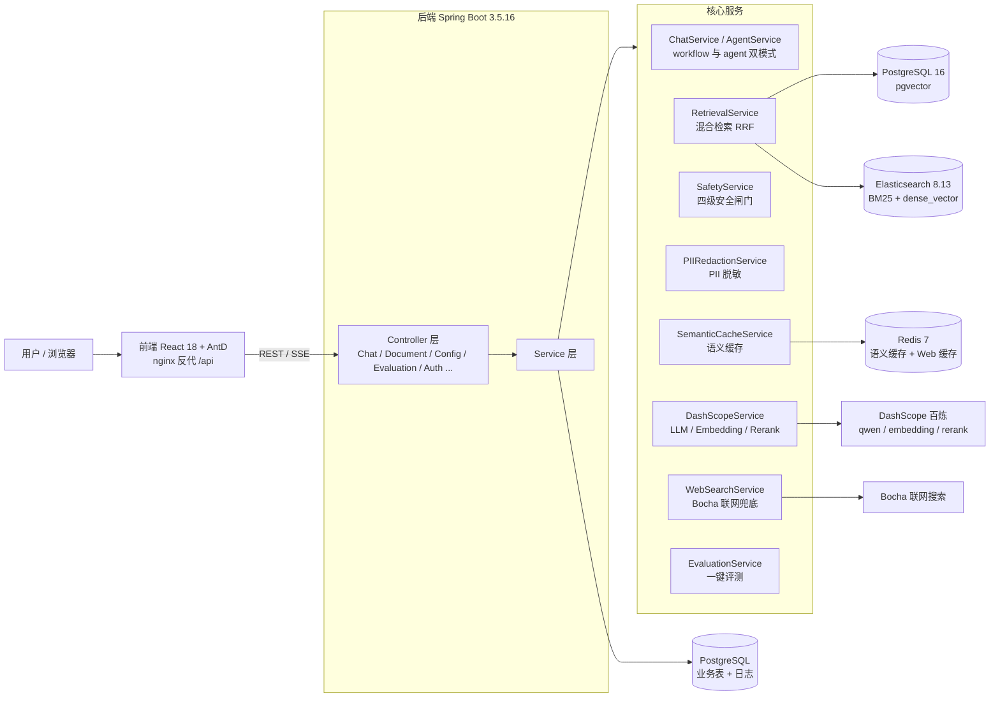

# 架构与设计取舍

本文档记录 RAG 评测服务 v2 的架构总览，以及关键设计决策背后的「为什么」与代价。面向面试讲解与后续演进。

## 一、架构总览

**数据流（workflow 模式）**：请求 → 加载历史 → 混合检索（ES 关键词 + 向量语义并行召回 → RRF 融合 → 可选 qwen3-rerank 精排）→ 安全闸门（注入防御 / 关键词黑名单 / 相似度阈值 / 越界检测）→ 语义缓存命中则直返 → LLM 生成 → PII 脱敏 → 落库 + 指标。

**数据流（agent 模式）**：检索与联网作为两个 tool（`search_knowledge_base` / `search_web`）交给 LLM 自主决策循环；安全与脱敏**保留在代码层**，不作为 tool 暴露。

**入库流**：上传落盘返回 PENDING → 后台线程 Tika 解析（含 OCR）→ 分块 → DashScope embedding → 双写 pgvector + ES → 标 READY。

## 二、关键设计取舍

### 1. 混合检索用 RRF，而不是加权融合

- **决策**：ES BM25 关键词 + 向量语义并行召回，用 RRF（Reciprocal Rank Fusion）合并，`k = 60`。
- **为什么**：BM25 分和余弦相似度**不在同一量纲**，直接加权必须先各自归一化，而归一化方法对结果影响很大且脆弱。RRF 只关心排名（`Σ 1/(k+rank)`），天然免去量纲问题，确定性强、零额外 API 成本、零额外延迟。
- **代价**：丢弃了原始分数的绝对值（只保留相对排名）；一个「低分但排第一」的结果和一个「高分但排第二」的结果在 RRF 里贡献等价。这也是为什么后面还有相似度阈值闸门兜底。

### 2. 向量库双写 + 运行时切换（pgvector / ES dense_vector）

- **决策**：所有 chunk 同时写入 pgvector 和 ES dense_vector，`vector.backend` 决定实际检索用哪个。
- **为什么**：切换后端无需重新入库，可在「SQL 原生、可 JOIN 业务表」与「关键词 + 向量同引擎、运维统一」之间按需切换；也便于对比两种向量库的检索质量。
- **代价**：双份存储 + 双份写入开销；两库存在不一致窗口（靠「一键重建索引」兜底）。

### 3. 单节点 ES 与副本数

- **决策**：`discovery.type: single-node`，副本数固定 1。
- **为什么**：学习/面试展示场景，无高可用需求；单节点无法为副本分配「另一台机器」，设 >1 只会产生未分配副本（集群变黄）而无容灾收益。
- **代价**：机器/磁盘挂掉即数据全失（仅靠数据卷持久化，非容灾）。多节点集群下副本设置才有意义。

### 4. 运行时热配置（免重启）

- **决策**：配置存 `system_config` 表 + `ConfigService` 内存覆盖层；API Key / 模型变更时 DashScope 模型实例**懒重建**（`refreshModels` 按 key 判断是否重建）。
- **为什么**：检索参数、模型、安全阈值、缓存开关等频繁调优，免重启能极大缩短「调参 → 验证」循环。
- **代价**：引入「DB 配置 + 内存覆盖」两层状态，读路径多一次判断；热换 API Key 需要 `mutate().dashScopeApi()` 重建实例的逻辑复杂度。

### 5. Agent 模式下安全逻辑留在代码层，不作为 tool 暴露

- **决策**：提示注入防御、关键词黑名单、PII 脱敏**始终在代码层执行**，`search_knowledge_base` / `search_web` 只做检索。
- **为什么**：tool 一旦交给 LLM 决策，等于把「是否执行安全检查」的控制权让渡给模型；把安全留在代码层能保证其**不可被绕过**（无论 LLM 怎么调用 tool）。
- **代价**：Agent 的「自主性」受限——它只能决定「检索还是联网」，不能决定「是否脱敏」。

### 6. 语义缓存：问题归一化 + 相似度阈值

- **决策**：将问题归一化（小写 / 去空格）后哈希查 Redis，命中直接返回，`similarity-threshold = 0.92`。
- **为什么**：近义词/格式差异导致的重复提问能命中缓存，省去检索 + LLM 生成的延迟与 token 成本。
- **代价**：相似度阈值过高则命中率低，过低则可能把「语义相近但答案应不同」的问题误命中。

### 7. 嵌入维度全局锁定 1024

- **决策**：`text-embedding-v3` 锁定 1024 维，pgvector `vector(1024)` 与 ES dense_vector `dims=1024` 三处对齐。
- **为什么**：向量维度不一致会导致索引/检索直接失败；锁定后避免「换了 embedding 模型但没重建索引」的隐蔽事故。
- **代价**：不支持多维度 embedding 模型共存；换维度必须全量重建。

### 8. 无状态鉴权（BCrypt + Bearer Token）

- **决策**：密码 BCrypt 哈希，登录签发 Bearer Token，`@PreAuthorize` 方法级权限；文档四档可见性（PUBLIC / DEPARTMENT / EXECUTIVE / PRIVATE）在 `AuthorizationService` 判定。
- **为什么**：无状态便于水平扩展，不依赖服务端 session；RBAC 三层模型（用户-角色-权限）与文档可见性解耦。
- **代价**：Token 撤销/失效需要额外机制；四档可见性 + 部门归属的组合判定有一定复杂度。

### 9. SSE 流式而非 WebSocket

- **决策**：对话与评测进度用 SSE（Server-Sent Events）单向推送。
- **为什么**：场景是「服务端 → 客户端」单向流（生成 token / 评测进度），SSE 基于 HTTP、实现简单、天然支持断线重连，无需 WebSocket 的双向 + 心跳维护。
- **代价**：无法客户端主动 push（当前也不需要）。

### 10. 评测：规则指标 + LLM-as-Judge 双轨

- **决策**：5 项规则指标（faithfulness / context-precision / answer-compliance / refusal-appropriate / style-consistent）+ 可选的 LLM-as-Judge 大模型评测，三检索模式横向对比。
- **为什么**：规则指标可复现、零成本、可自动化回归；LLM 评测覆盖规则难以量化的语义维度（如回答风格、相关性）。
- **代价**：LLM-as-Judge 引入额外的 API 成本与「裁判模型自身偏差」；结果持久化 + 历史回看增加了存储与 UI 复杂度。
